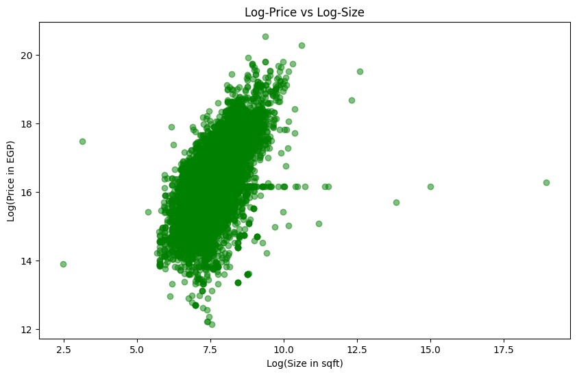
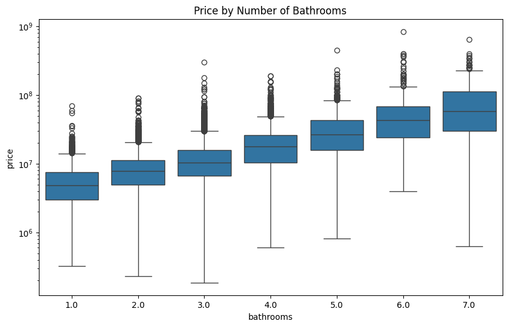

# Real Estate of Egypt - Property Analysis & Segmentation

A comprehensive analysis and segmentation project for the Egyptian real estate market, leveraging machine learning techniques to uncover pricing patterns, property characteristics, and market segments.

## 📊 Project Overview

This project analyzes Egyptian real estate data to identify key market trends, price distributions, and property segments. The analysis includes exploratory data analysis (EDA), feature engineering, and customer segmentation using clustering algorithms.

## 🔍 Key Visualizations

### Geographic Analysis

<div align="center">
  
  
</div>

**Insights:** El Katameya leads in average property prices among cities, while El Katameya Compounds dominates at the district level.

---

### Compound & Government Analysis

<div align="center">
  
  
</div>

**Insights:** Concord Plaza ranks highest among compounds, while Hay Shobra (Cairo) leads in governorate-level pricing.

---

### Price Distribution Analysis

<div align="center">
  
  
</div>

**Insights:** Significant price variations exist across governorates, with notable outliers in premium locations.

---

### Price-Size Relationships

<div align="center">
  
  
</div>

**Insights:** Strong positive correlation between property size and price, with clear city-based clustering patterns.

---

### Property Characteristics

<div align="center">
  
  
</div>

**Insights:** Most properties have 3 bedrooms and 3 bathrooms, representing the most common configuration in the market.

---

### Price by Property Features

<div align="center">
  
  
</div>

---

<div align="center">
  
</div>

**Insights:** Property prices increase progressively with the number of bedrooms and bathrooms, showing exponential growth at higher counts.

---

### Average Price Analysis

<div align="center">
  
  
</div>

---

<div align="center">
  
</div>

**Insights:** Properties with maid rooms command higher average prices across all bedroom counts, indicating a premium feature.

---

### Property Type Analysis

<div align="center">
  
  
</div>

**Insights:** Apartments dominate the market, while Palaces command the highest average prices.

---

<div align="center">
  
</div>

---

<div align="center">
  
</div>

**Insights:** Property type distribution varies significantly across cities, with distinct pricing patterns for each type and location combination.

---

## 🛠️ Technologies Used

- **Python 3.x**
- **Pandas** - Data manipulation and analysis
- **NumPy** - Numerical computing
- **Matplotlib & Seaborn** - Data visualization
- **Scikit-learn** - Machine learning and clustering
- **Jupyter Notebook** - Interactive development environment

## 📁 Project Structure

```
├── model.ipynb          # Main analysis notebook
├── data/               # Dataset directory
├── screen/             # Visualization screenshots
└── README.md          # Project documentation
```

## 🚀 Getting Started

### Prerequisites

```bash
pip install -r requierments.txt
```

### Running the Analysis

1. Clone the repository:
```bash
git clone https://github.com/youssefelzahar/Real-estate-of-egypt.git
cd Real-estate-of-egypt
git checkout segmentation
```

2. Launch Jupyter Notebook:
```bash
jupyter notebook model.ipynb
```

3. Run all cells to reproduce the analysis

## 📈 Analysis Pipeline

1. **Data Loading & Cleaning**
   - Import raw data
   - Handle missing values
   - Remove duplicates
   - Data type conversions

2. **Exploratory Data Analysis (EDA)**
   - Statistical summaries
   - Distribution analysis
   - Correlation analysis
   - Geographic patterns

3. **Feature Engineering**
   - Price per square foot calculation
   - Categorical encoding
   - Feature scaling and transformation

4. **Segmentation Analysis**
   - K-means clustering
   - Hierarchical clustering
   - Segment profiling
   - Insight generation

## 🎯 Key Findings

- **Premium Locations**: El Katameya and New Cairo dominate high-value segments
- **Property Configuration**: 3-bedroom, 3-bathroom properties are most common
- **Price Drivers**: Size, location, and amenities (especially maid rooms) significantly impact pricing
- **Property Types**: Apartments dominate supply, while Palaces represent ultra-luxury segment
- **Market Segmentation**: Clear clusters exist based on price points and property features

## 👥 Contributors

- **Youssef Elzahar** - [GitHub](https://github.com/youssefelzahar)

## 📄 License

This project is open source and available under the [MIT License](LICENSE).

## 🤝 Contributing

Contributions, issues, and feature requests are welcome! Feel free to check the [issues page](https://github.com/youssefelzahar/Real-estate-of-egypt/issues).

## 📧 Contact

For questions or feedback, please reach out through GitHub issues or contact the repository owner.

---

⭐ **Star this repository if you find it helpful!**